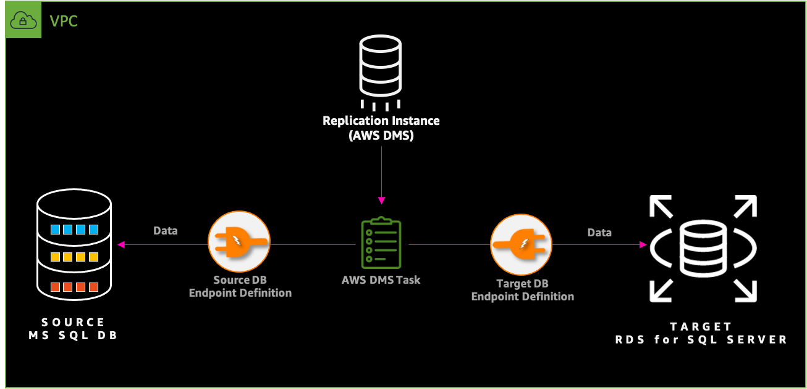
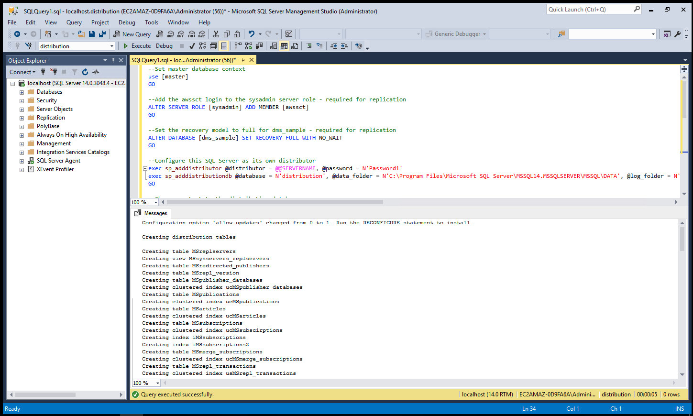
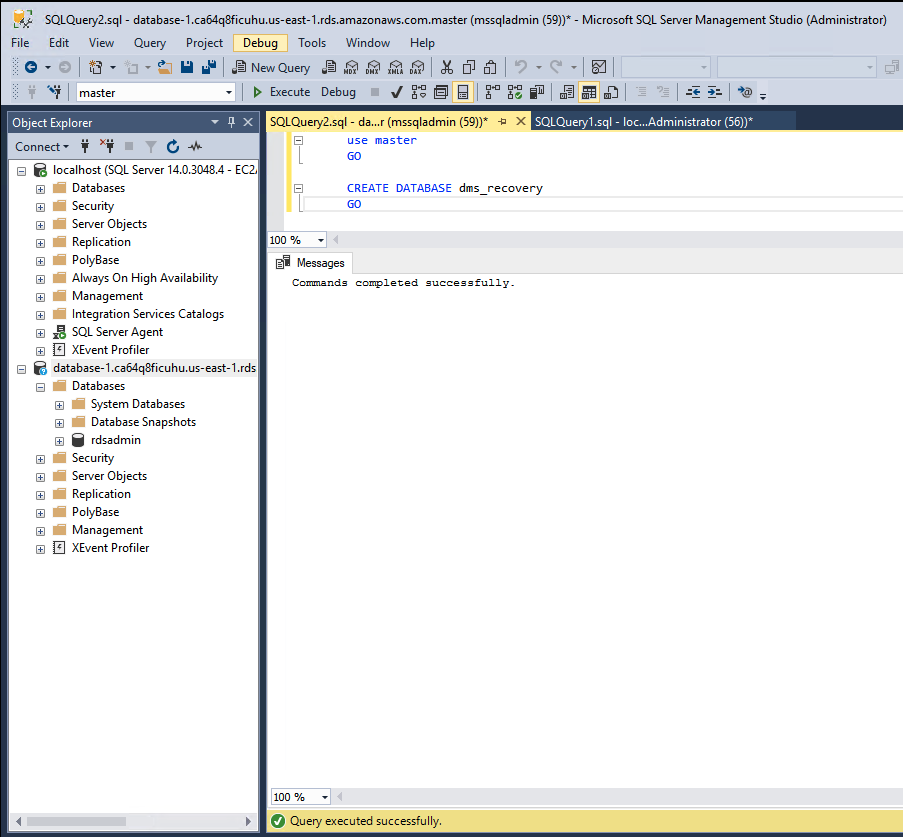
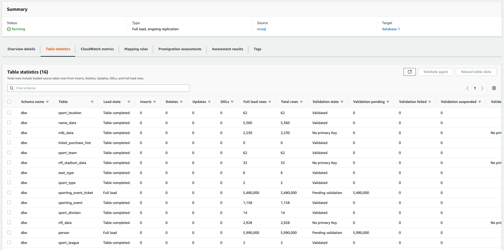
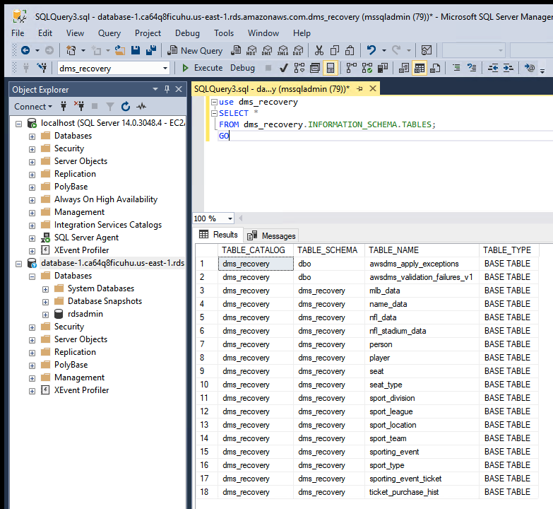
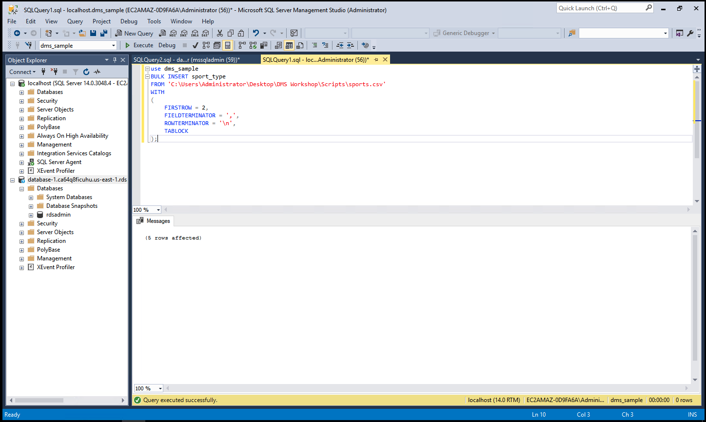
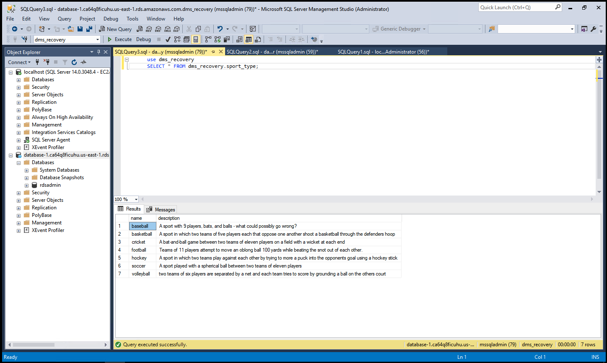

# Migrate your Microsoft SQL Database To Amazon RDS for SQL Server

Mystique Unicorn App backend is hosted on Microsoft SQL Server. Recently one of their devs discovered that AWS offers Amazon RDS for SQL Server a fast, scalable, highly available, and fully managed relational database service that supports Microsoft SQL workloads.

Can you help them migrate from mssql hosted on prem(or EC2) to Amazon RDS for SQL Server?

## 🎯 Solutions

We will follow an multi-stage process to accomplish our goal. We need the following components to get this right,

1. **Source Database - MS SQL DB**
   - If in AWS: EC2 instance in a VPC, Security Group, SSH Keypair(Optional)
   - Some dummy data inside the database
   - SSIS pre-installed
   - MySQL Workbench pre-installed
1. **Destination Database - Amazon RDS for SQL Server DB**
   - Subnet Groups
   - VPC Security Groups
1. **Database Migration Service(DMS) - Replication Instance**
   - DMS IAM Roles
   - Endpoints
   - Database Migration Tasks



In this article, we will build an architecture, similar to the one shown above - A simple database running mssql instance running on EC2 _(You are welcome to use your own ms sqldb instead_). For target we will build a Amazon RDS for SQL Server DB and use DMS to migrate the data.

In this Workshop you will practice how to migrate your MS SQL DB databases to Amazon RDS for SQL Server DB using different strategies.

1.  ## 🧰 Prerequisites

    This demo, instructions, scripts and cloudformation template is designed to be run in `us-east-1`. With few modifications you can try it out in other regions as well(_Not covered here_).

    - 🛠 AWS CLI Installed & Configured - [Get help here](https://youtu.be/TPyyfmQte0U)
    - 🛠 AWS CDK Installed & Configured - [Get help here](https://www.youtube.com/watch?v=MKwxpszw0Rc)
    - 🛠 Python Packages, _Change the below commands to suit your OS, the following is written for amzn linux 2_
      - Python3 - `yum install -y python3`
      - Python Pip - `yum install -y python-pip`
      - Virtualenv - `pip3 install virtualenv`

    As there are a number of components that need to be setup, we will use a combination of Cloudformation(generated from CDK), CLI & GUI.

1.  ## ⚙️ Setting up the environment

    - Get the application code

      ```bash
      git clone https://github.com/miztiik/mssql-to-rds-mssql
      cd mssql-to-rds-mssql
      ```

      **NOTE: RUN THIS STACK IN VIRIGINA ONLY._The MS SQL AMI in th stack is from virigin region_**

1.  ## 🚀 Prepare the environment

    We will need cdk to be installed to make our deployments easier. Lets go ahead and install the necessary components.

    ```bash
    # If you DONT have cdk installed
    npm install -g aws-cdk

    # Make sure you in root directory
    python3 -m venv .env
    source .env/bin/activate
    pip3 install -r requirements.txt
    ```

    The very first time you deploy an AWS CDK app into an environment _(account/region)_, you’ll need to install a `bootstrap stack`, Otherwise just go ahead and deploy using `cdk deploy`.

    ```bash
    cdk bootstrap
    cdk ls
    # Follow on screen prompts
    ```

    You should see an output of the available stacks,

    ```bash
    mssql-to-rds-mssql-vpc-stack
    mssql-to-rds-mssql-database-migration-prerequisite-stack
    mssql-to-rds-mssql-mssql-on-windows-ec2
    ```

1.  ## 🚀 Deploying the Target Database - Amazon RDS for SQL Server DB

    We can automate the creation of Amazon RDS for SQL Server DB & DMS using CDK, But since this will be the first time we use these services,let us use the Console/GUI to set them up. We can leverage the excellant [documentation from AWS](https://aws.amazon.com/getting-started/hands-on/create-microsoft-sql-db/) on how to setup our Aurora DB. (Use your best judgement, as docs tend to change over a period of time)

    Couple of things to note,

    - For VPC - Use our custom VPC `miztiikMigrationVpc`
    - For Security Group - Use `mssql_db_sg_database-migration-prerequisite-stack`
    - Set the admin name as `mssqladmin`
    - Set your password as `Som3thingSh0uldBe1nVault`

    Make a note of the db endpoint, admin user name and password. We will use it later.

1.  ## 🚀 Deploying the Source Database

    Let us walk through each of the stacks,

    - **Stack: mssql-to-rds-mssql-vpc-stack**
      This stack will do the following,

      1. Create an custom VPC `miztiikMigrationVpc`(_We will use this VPC to host our source MS SQL DB, Aurora DB, DMS Replication Instance_)

      Initiate the deployment with the following command,

      ```bash
      cdk deploy mssql-to-rds-mssql-vpc-stack
      ```

    - **Stack: mssql-to-rds-mssql-database-migration-prerequisite-stack**
      This stack will create the following resources,

      1. Aurora DB & DMS Security groups - (_created during the prerequisite stack_)
         - Port - `3306` _Accessible only from within the VPC_
      1. DMS IAM Roles - (This stack will **FAIL**, If these roles already exist in your account)
         - `AmazonDMSVPCManagementRole`
         - `AmazonDMSCloudWatchLogsRole`
      1. SSH KeyPair using a custom cfn resource
         - The key material is stored in SSM Parameter Store `mystique-automation-ssh-key`

      Initiate the deployment with the following command,

      ```bash
      cdk deploy mssql-to-rds-mssql-database-migration-prerequisite-stack
      ```

      After successful completion, take a look at all the resources and get yourself familiar with them. We will be using them in the future.

    - **Stack: `mssql-to-rds-mssql-mssql-on-windows-ec2` Source Database - MS SQL DB**

      We will be using AWS prepared provided AMI. This AMI comes preinstalled with MSSQL DB, SSIS. MySQL WorkBench and Amazon Schema Conversion Tool(SCT). The stack has been designed to use the `viriginia : us-east-1` AMI. If you plan to run on other regions, you can use the below AMI IDs. Now lets continue with virginia
      `viriginia : us-east-1 : ami-045d48ee4dd4f5210`
      `us-east-2 : Ohio : ami-021e119b2b955586a`
      `us-west-2 : Oregon : ami-04f6666670bad6990`

      This stack will do the following,

      1. Create an EC2 `m5.large` instance inside our custom VPC(_created during the prerequisite stack_)
      1. Attach security group with MS SQL port(`1433`) open within the VPC (_For any use-case other than sandbox testing, you might want to restrict it_)

      Initiate the deployment with the following command,

      ```bash
      cdk deploy mssql-to-rds-mssql-mssql-on-windows-ec2
      ```

      As we need to migrate from Microsoft SQL to Amazon RDS for SQL Server, We need to ensure the schema is compatible between two database engine. We will use the Amazon SCT to achieve that.

      **Prepare Source MS SQL Server**

      - Log In to the EC2 server.

        1. To get the Administrator password, Use the SSH key from the SSM Parameter Store.

      - Use the following values to _connect_ to your source database.

        | Parameter     | Value                  |
        | ------------- | ---------------------- |
        | Server Type   | Database Engine        |
        | Server Name   | localhost              |
        | Authorization | Windows Authentication |

      - When migrating your Microsoft SQL Server database using AWS DMS, you can choose to migrate existing data only, migrate existing data and replicate ongoing changes, or migrate existing data and use change data capture (CDC) to replicate ongoing changes. Migrating only the existing data does not require any configuration on the source SQL Server database. However, to migrate existing data and replicate ongoing changes, you need to either enable MS-REPLICATION, or MS-CDC. Replication requires a primary key for all tables that are being replicated. If your tables don’t have primary keys defined, consider using MS-CDC instead.

      - Execute a `.sql` script that will configure the source database for replication:

      1. Open `prep_src_mssql_ConfigSourceSQLServer.sql` with a text editor on your computer.
      1. Copy the content to SQL Server Management Studio query editor.
      1. Execute the script.

         

      **Prepare TARGET: Amazon RDS for SQL Server**

      - From within SQL Server Management Studio, select SQL Server Authentication and connect to the SQL Server RDS instance using the following parameters:

        | Parameter      | Value                       |
        | -------------- | --------------------------- |
        | Server Type    | Database Engine             |
        | Server Name    | < TargetSQLServerEndpoint > |
        | Authentication | SQL Server Authentication   |
        | Login          | `mssqladmin`                |
        | Password       | `Som3thingSh0uldBe1nVault`  |

      - Open a New Query window. Run the following script to create a target database `dms_recovery` on RDS SQL Server.

      ```sql
      use master
      GO

      CREATE DATABASE dms_recovery
      GO
      ```

      

      The target database (`dms_recovery`) has now been created. Now we are all done with our target database & ready for migration.

1.  ## 🚀 Deploying the DMS Replication Instance

    We can leverage the excellant [documentation from AWS](https://docs.aws.amazon.com/dms/latest/userguide/CHAP_GettingStarted.html) on how to setup our DMS Replication Instance.

    Couple of things to note,

    - For VPC - Use our custom VPC `miztiikMigrationVpc`
    - For Security Group - Use `dms_sg_database-migration-prerequisite-stack`

    After creating the replication instance, We need to create few more resources to begin our replication. We will use defaults mostly

    - **Endpoints for source MS SQL DB**(_custom values listed below_)

      | Parameter            | Value                                            |
      | -------------------- | ------------------------------------------------ |
      | Endpoint Type        | Source endpoint                                  |
      | Endpoint Identifier  | `sqlserver-source`                               |
      | Source Engine        | `sqlserver`                                      |
      | Server Name          | < SourceEC2PrivateDns >                          |
      | Port                 | 1433                                             |
      | SSL Mode             | none                                             |
      | User Name            | `awssct`                                         |
      | Password             | `Password1`                                      |
      | Database Name        | `dms_sample`                                     |
      | Test                 | endpoint connection -> VPC `miztiikMigrationVpc` |
      | Replication Instance | DMSReplication                                   |

    - **Endpoint for destination databases - Amazon RDS for SQL Server DB**(_custom values listed below_)

      | Parameter            | Value                                            |
      | -------------------- | ------------------------------------------------ |
      | Endpoint Type        | Target endpoint                                  |
      | Select               | RDS DB instance                                  |
      | Endpoint Identifier  | `sqlserver-target`                               |
      | Source Engine        | sqlserver                                        |
      | Server Name          | < TargetAuroraMySQLEndpoint >                    |
      | Port                 | 1433                                             |
      | SSL Mode             | none                                             |
      | User Name            | `mssqladmin`                                     |
      | Password             | `Som3thingSh0uldBe1nVault`                       |
      | Database Name        | `dms_recovery`                                   |
      | Test                 | endpoint connection -> VPC `miztiikMigrationVpc` |
      | Replication Instance | DMSReplication                                   |

    - **Database Migration Task**

      - Click on Database migration tasks on the left-hand menu, then click on the Create task button on the top right corner.

        | Parameter                           | Value                                               |
        | ----------------------------------- | --------------------------------------------------- |
        | Task identifier                     | SQLMigrationTask                                    |
        | Replication instance                | DMSReplication                                      |
        | Source database endpoint            | `sqlserver-source`                                  |
        | Target database endpoint            | `sqlserver-target`                                  |
        | Migration type                      | Migrate existing data and replicate ongoing changes |
        | Start task on create                | Checked                                             |
        | CDC stop mode                       | Don’t use custom CDC stop mode                      |
        | Target table preparation mode       | Do nothing                                          |
        | Stop task after full load completes | Don’t stop                                          |
        | Include LOB columns in replication  | Limited LOB mode                                    |
        | Max LOB size (KB)                   | 32                                                  |
        | Enable validation                   | Unchecked                                           |
        | Enable CloudWatch logs              | Checked                                             |

      - Expand the Table mappings section, and select Guided UI for the editing mode.

      - Click on Add new selection rule button and enter the following values in the form:

        | Parameter  | Value   |
        | ---------- | ------- |
        | Schema     | `dbo`   |
        | Table name | %       |
        | Action     | Include |

      **NOTE:** If the Create Task screen does not recognize any schemas, make sure to go back to endpoints screen and click on your endpoint. Scroll to the bottom of the page and click on Refresh Button (⟳) in the Schemas section. If your schemas still do not show up on the Create Task screen, click on the Guided tab and manually select ‘dbo’ schema and all tables.

      - _Next_, expand the **Transformation** rules section, and click on **Add new transformation** rule using the following values:

        | Parameter   | Value                   |
        | ----------- | ----------------------- |
        | Target      | Schema                  |
        | Schema Name | dbo                     |
        | Action      | Rename to: dms_recovery |

      - After entering the values click on **Create task**. At this point, the task should start running and replicating data from the `dms_sample` database running on EC2 to the Amazon RDS SQL Server instance.

      - As the rows are being transferred, you can monitor the task progress:

        1. Click on your task (_SQLMigrationTask_) and scroll to the Table statistics section to view the table statistics to see how many rows have been moved.
        1. If there is an error, the status color changes from green to red. Click on View logs link for the logs to debug.

      

1.  ## 🔬 Test Full Data Load and Continuous Replication

    Navigate to DMS task, under `Table Statistics` You should be able observe that the dms has copied the data from source to target database. You can connect to RDS SQL DB and test the records using the same commands that we used with source earlier.

    - Open Microsoft SQL Server Management Studio from within the EC2 server. Follow the instructions described earlier to connect to the Target RDS SQL Server instance.
    - Inspect the migrated RDS SQL database (`dms_recovery`) content, and make sure the following tables have migrated over. You can do that by opening a New Query window to execute the following statement. You should see a total of `16` tables.

      ```sql
      use dms_recovery
      SELECT *
      FROM dms_recovery.INFORMATION_SCHEMA.TABLES;
      GO
      ```

    - Next, execute the following query:

      ```sql
      use dms_recovery
      SELECT * FROM dms_recovery.sport_type;
      GO
      ```

      

    _Ignore the two tables created by DMS for validations_

    **Replicating Data Changes: CDC**

    - We are going to simulate a transaction to the source database by updating the `sport_type` table. The Database Migration Service will automatically detect and replicate these changes to the target database.
    - Use Microsoft SQL Server Management Studio to connect to the Source SQL Server on the EC2 instance.
    - Open a New Query window and execute the following statement to insert `5` new sports into the `sport_type` table,

      ```sql
      use dms_sample
      BULK INSERT sport_type
      FROM 'C:\Users\Administrator\Desktop\DMS Workshop\Scripts\sports.csv'
      WITH
      (
          FIRSTROW = 2,
          FIELDTERMINATOR = ',',
          ROWTERMINATOR = '\n',
          TABLOCK
      );
      ```

      

    - This time use Microsoft SQL Server Management Studio to connect to the Target SQL Server running on an Amazon RDS instance. Open a New Query window and execute the following statement,

      ```sql
      use dms_recovery
      SELECT * FROM dms_recovery.sport_type;
      ```

      

      The AWS DMS task keeps the target SQL Server database up to date with source database changes. AWS DMS keeps all the tables in the task up to date until it’s time to implement the application migration. The latency is close to zero, when the target has caught up to the source.

    _Additional Learnings:_ You can check the logs in cloudwatch for more information or increase the logging level of the database migration task.

1.  ## 📒 Conclusion

    Here we have demonstrated how to use Amazon Database Migration Service(DMS) to migrate data from MS SQL DB to Aurora DB.

1.  ## 🎯 Additional Exercises

    - Try to use the selection rules to ignore some tables
    - Try to use the transformation rules to change cases of columns or tables.

1.  ## 📊 📈 Performance Tips

    If your table has volume transactions, > 100 tps, then you can try these,

    - Create muliple replication instances
    - Create tasks for each of the tables to be migrated
    - Perform full load and CDC

1)  ## 🧹 CleanUp

    If you want to destroy all the resources created by the stack, Execute the below command to delete the stack, or _you can delete the stack from console as well_

    - Resources created during [Deploying The Application](#deploying-the-application)
    - Delete CloudWatch Lambda LogGroups
    - _Any other custom resources, you have created for this demo_

    ```bash
    # Delete from cdk
    cdk destroy

    # Follow any on-screen prompts

    # Delete the CF Stack, If you used cloudformation to deploy the stack.
    aws cloudformation delete-stack \
        --stack-name "MiztiikAutomationStack" \
        --region "${AWS_REGION}"
    ```

    This is not an exhaustive list, please carry out other necessary steps as maybe applicable to your needs.

## 📌 Who is using this

This repository aims to teach api best practices to new developers, Solution Architects & Ops Engineers in AWS. Based on that knowledge these Udemy [course #1][103], [course #2][102] helps you build complete architecture in AWS.

### 💡 Help/Suggestions or 🐛 Bugs

Thank you for your interest in contributing to our project. Whether it is a bug report, new feature, correction, or additional documentation or solutions, we greatly value feedback and contributions from our community. [Start here](/issues)

### 👋 Buy me a coffee

[](https://ko-fi.com/Q5Q41QDGK) Buy me a [coffee ☕][900].

### 📚 References

1. [Creating tasks for ongoing replication using AWS DMS][1]

1. [Using a Microsoft SQL Server database as a source for AWS DMS][2]

### 🏷️ Metadata


**Level**: 300

[1]: https://docs.aws.amazon.com/dms/latest/userguide/CHAP_Task.CDC.html
[2]: https://docs.aws.amazon.com/dms/latest/userguide/CHAP_Source.SQLServer.html
[100]: https://www.udemy.com/course/aws-cloud-security/?referralCode=B7F1B6C78B45ADAF77A9
[101]: https://www.udemy.com/course/aws-cloud-security-proactive-way/?referralCode=71DC542AD4481309A441
[102]: https://www.udemy.com/course/aws-cloud-development-kit-from-beginner-to-professional/?referralCode=E15D7FB64E417C547579
[103]: https://www.udemy.com/course/aws-cloudformation-basics?referralCode=93AD3B1530BC871093D6
[899]: https://www.udemy.com/user/n-kumar/
[900]: https://ko-fi.com/miztiik
[901]: https://ko-fi.com/Q5Q41QDGK
